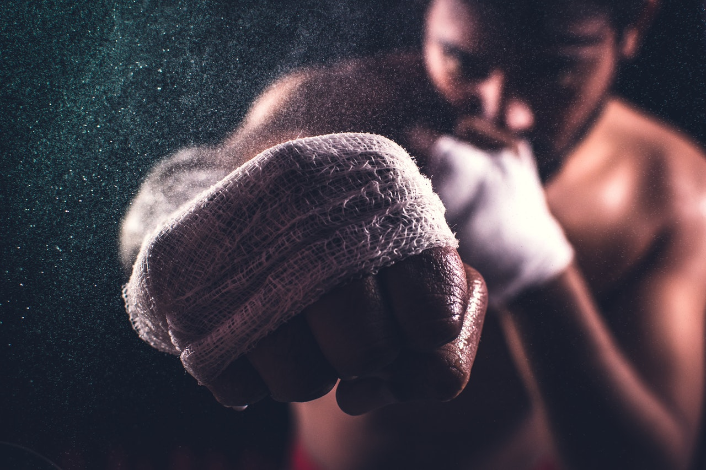

Some rounds of shadow boxing and a nice circuit from [TheProgrm](https://theprogrm.com/).

**3x2min Shadow Boxing** 
2min Hands 
2min Legs 
2min Combined 

*Notes* 
Set your focus on quality and technics, we have a longer cicruit afterwards.

**16x 40sec ON / 20sec OFF** 
Rotate through the following exercises: 
* [High Knees](https://www.youtube.com/watch?v=JXznOw0uElU)
* [Glute Bridges](https://www.youtube.com/watch?v=WtilA9IJX1c)
* [Wall sit](https://www.youtube.com/watch?v=-cdph8hv0O0)
* Down Ups (Burpees without a jump at the end)

**As always: have fun and stay positive :)**

