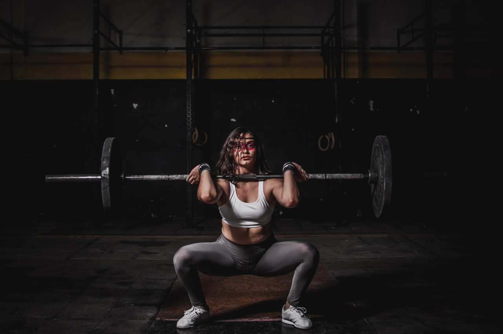

Let us have some Thrusters today - thank me later.

**METCON: 3 Rounds for Time** 
* 1k [Row](https://www.youtube.com/watch?v=4zWu1yuJ0_g&feature=emb_title) OR 400m [Run](https://images.app.goo.gl/zGgQFQUMa6pvwRsA6) OR 100 [Jumping Jacks](https://www.youtube.com/watch?v=SfaNwjsK0Lo)
* 50 [Thrusters](https://www.youtube.com/watch?v=L219ltL15zk) (empty [Barbell](https://www.youtube.com/watch?v=r4ckc2c5V-s), light [Dumbbells](https://www.youtube.com/watch?v=M5gEwLTtWbg) or for example two bottles of water)

**CORE: 4 Rounds** 
* 20 [V Ups](https://www.youtube.com/watch?v=Mk4zCq9b6hU)
* 40 [Russian Twists](https://www.youtube.com/watch?v=mzul2RtPeOo)

**Enjoy the Thrusters :)**

