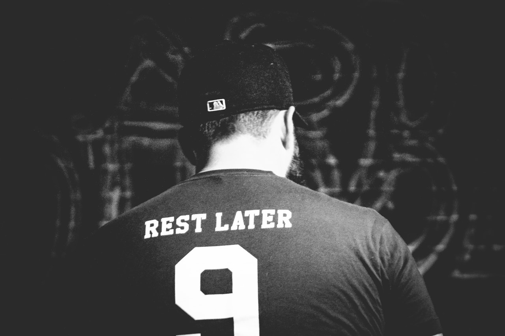

Today is a traditional Crossfit training day. A strength part and a Mecton, that's it.

**STRENGTH** 
* 5x5 [Strict Pull Ups](https://www.youtube.com/watch?v=HRV5YKKaeVw) ([Banded](https://www.youtube.com/watch?v=W7X-uoHpa4c) or [weighted](https://www.youtube.com/watch?v=dntiFx5q22A), dependent on your level)
* 5x5 [Strict Handstand Push Ups](https://www.youtube.com/watch?v=0wDEO6shVjc) (30sec [handstand-hold](https://www.youtube.com/watch?v=LwnOCipO4QY) or [pike push ups](https://www.youtube.com/watch?v=x7_I5SUAd00) if you can't do handstand push ups)

*Notes* 
Do 5 Pull Ups, then 5 Handstand Push Ups, then 5 Pull Ups, and so on.

**METCON: 5 Rounds for time** 
* 9-12 [Pistol Squats](https://www.youtube.com/watch?v=qDcniqddTeE) ([assisted](https://images.app.goo.gl/fbXrxfSebWp5XmoS9) or [elevated](https://images.app.goo.gl/S1euRbPNn8gEZLuh6) if you can't do them)
* 15 [Hollow Rocks](https://www.youtube.com/watch?v=p7j02V1fIzU)
* 14-16 [Renegade Rows](https://www.youtube.com/watch?v=PJpTBj4ilZw) (any weight you have)

*Notes* 
I used a 15kg dumbbell for the renegade rows and did push ups in between. Finished at 10:06. 
Don't go to heavy.

**Stretch and meditate - it helps a lot :)**

