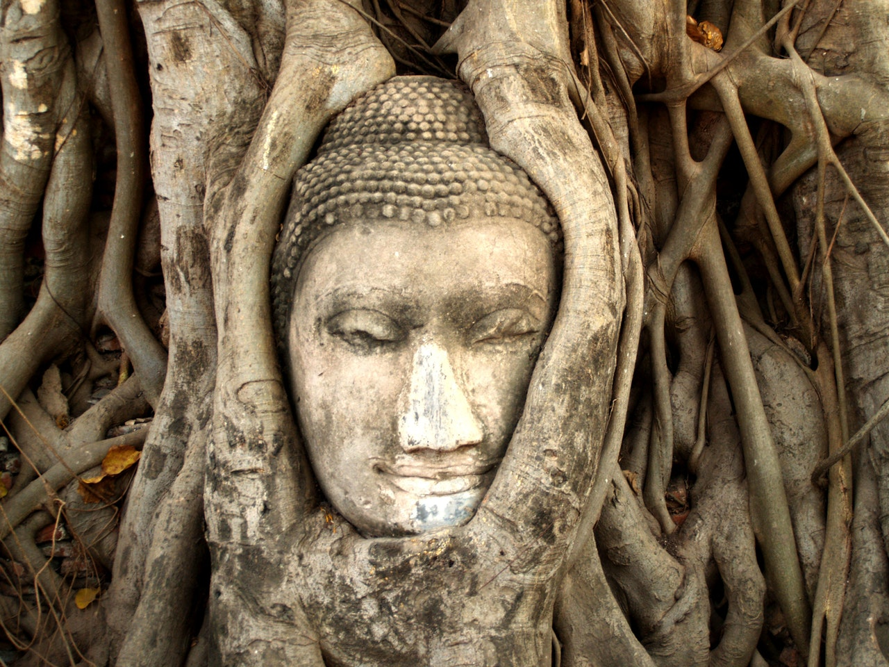

Today is restday. If you want to move try some active recovery.

If you need some more inspiration for your restday - once again a sample from [James Newburys Working In](https://app.sugarwod.com/marketplace/ultra-instinct/working-in):

**AM: Ultra Breath Ratio** 
1-1-2-1 for 9min 
Repeat your chosen times for 9min straight, start with: 
4sec inhale - 4sec hold - 8sec exhale - 4sec hold - repeat. 
If you're familiar with this kind of breathing work you can adjust: 
5sec inhale - 5sec hold - 10sec exhale - 5sec hold - repeat. 
6 - 6 - 12 - 6, ect. 
Do more than last week.

**Do you!** 
Movies, Beach, Walk, Netflix and Chill, Hot Tea and Read a Book.

**PM: Ultra Breath Ratio 2** 
1-4-2 for 9min 

**Stay strong.**

