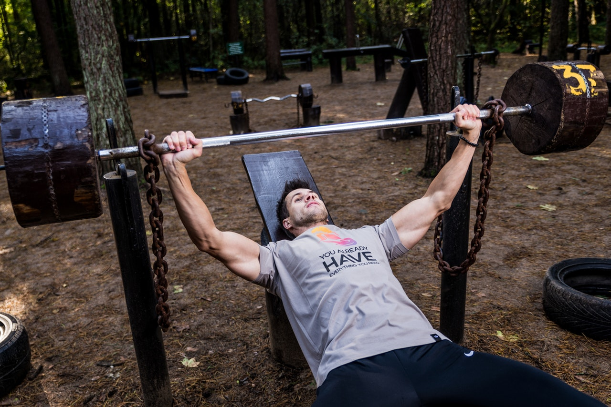

And once again a traditional Crossfit training day, with some Benchpress and a Metcon from [COMPTRAIN](https://comptrain.co/home-gym/).

**STRENGTH** 
* 3x10 [Benchpress](https://www.youtube.com/watch?v=XSza8hVTlmM) @ 60% of 1RM (1 Repetition Max)

*Notes* 
If you don't know your 1 Repetition Max, start at 1/3 of your bodyweight and go up if it's too easy (do not forget to count the weight of the bar as well).

**NO EQUIPMENT ALTERNATIVE** 
Use [Dumbbells](https://www.youtube.com/watch?v=G9nf-QZeYWI), Books, Bottles, etc. and perform it from the floor. 
Or you can do [Push-Ups with weight on your shoulders/back](https://www.youtube.com/watch?v=Q_FnrwhkdpU).

**METCON: Cookie Monster** 
AMRAP 15: 
20 Plate or [“Odd-Object” Ground-to-Overhead](https://www.youtube.com/watch?v=kRsckQhX0is&feature=youtu.be) 
20 Lateral Hops over “Odd-Object” 
20 Burpees 
20 Lateral Hops over “Odd-Object”

*Notes* 
If you have a jump-rope you can do 40 [Double-Unders](https://www.youtube.com/watch?v=-tF3hUsPZAI) or 80 [Single Unders](https://www.youtube.com/watch?v=hCuXYrTOMxI) instead of 20 Lateral Hops.

**Embrace the burn.**

