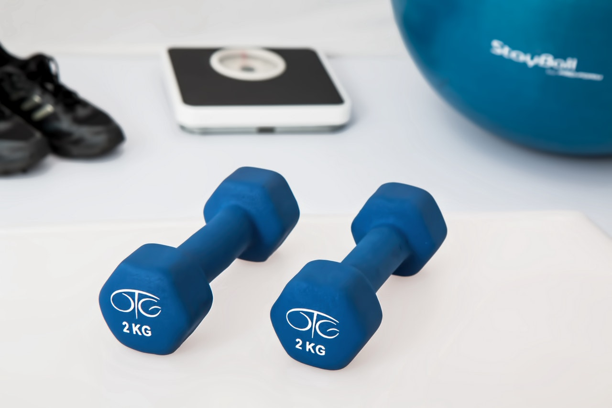

A Metcon and a Core piece.

**METCON: 15min AMRAP** 
* 10 [Dumbbell Hang Clean & Jerk](https://www.youtube.com/watch?v=ee0hJzll6wM) (5 per side)
* 20 [lateral Jumps over Dumbbell](https://www.youtube.com/watch?v=SRo-B9TiPuI)
* 10 Dumbbell Hang Clean & Jerk (5 per side)
* 10 [Dumbbell Overhead Squats](https://www.youtube.com/watch?v=fa_yJa2XwXk) (5 per side)

*Notes* 
I used a 22.5kg Dumbbell. If you have no Dumbbell use a Kettlebell, a water bottle, any object with some weight.

**Core: 3-5 RFT** 
* 10 [Hollow Rocks](https://www.youtube.com/watch?v=p7j02V1fIzU)
* 10 [Tuck Crunches](https://www.youtube.com/watch?v=4EJy-v6K0B0)
* 10 [Reverse Sit Ups](https://www.youtube.com/watch?v=-JTd-mYNQl4)

*Notes* 
Do the round unbroken and rest in between.

**As always: Have fun!**

