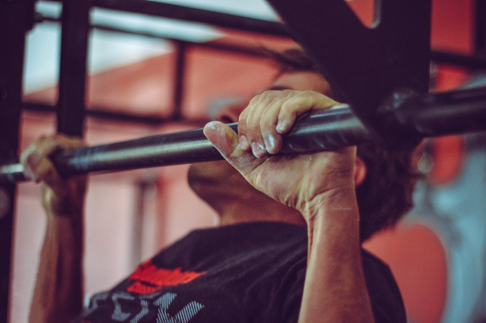

We're going to do a "lite" version of the hero-wod [Murph](https://wodwell.com/wod/murph/) today. 
Murph is one of my absolute favorites - because it is a mental and a physical test.

**METCON: Murph Lite** 
* 1.4km RUN
* 10 Rounds: 5 Pull-Ups, 10 Push-Ups, 15 Air Squats
* 1.4km Run

*Notes* 
You can substitute Pull-Ups with [Supine Rows](https://youtu.be/OYUxXMGVuuU?t=32). 
If you want to go real, you can do it with a weighted vest (9kg for men, 6kg for women).

**Enjoy! And we will do full Murph soon :)**

