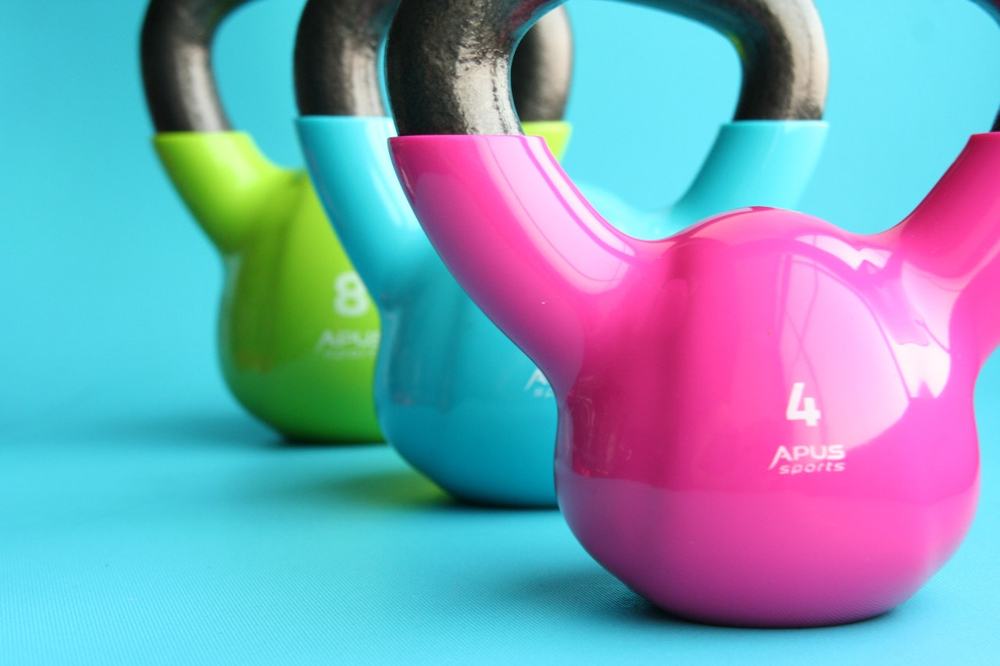

Some rounds for quality, no hurry no stress. Just enjoy.

**Warm Up: 2-3 Rounds**
* 4 [Walkouts](https://www.youtube.com/watch?v=6LHIfowttcc)
* 6 [Hip Hinges](https://youtu.be/sinpFajtRPw?t=17)
* 8 [Cossack Squats](https://www.youtube.com/watch?v=tpczTeSkHz0)
* 10 [Diagonal Windmills](https://www.youtube.com/watch?v=ITSmgn_BQgY) (without weight)

**4 Rounds**
* 8 [Sumo Deadlift High-Pull](https://www.youtube.com/watch?v=o6QniJ9FaGA)
* 3-8 [Strict Chin Ups](https://www.youtube.com/watch?v=mTRT9O5r8Wg)
* 8/8 [Single Arm Bent Over Row](https://www.youtube.com/watch?v=ma__uqUlYmE)

**4 Rounds**
* 8/8 [Single Arm Dumbbell Bench Press](https://www.youtube.com/watch?v=d6Ba29xFBnw)
* 20 [Shoulder Taps](https://www.youtube.com/watch?v=qGVomxz_QAc)
* 20 [American Kettlebell Swings](https://www.youtube.com/watch?v=d94xX-AQZ0A)

**4 Rounds**
* 20 [Hollow Rocks](https://www.youtube.com/watch?v=p7j02V1fIzU)
* 20 [Arch Ups](https://www.youtube.com/watch?v=RbOtOLnaeUQ)
* 20 [Heel Touches](https://www.youtube.com/watch?v=VnMXdc85vgA)
* 20 [Prone Swimmers](https://www.youtube.com/watch?v=IR3AKrOTpaA)

*Notes* 
For the High-Pulls, Bent Over Rows, Bench press and the American Swings you can use: 
a Barbell (only for High-Pulls), a Dumbbell, a Kettlebell or an Odd-Object (filled backpack, watter-bottle, etc.). Be creative and use what you have.

