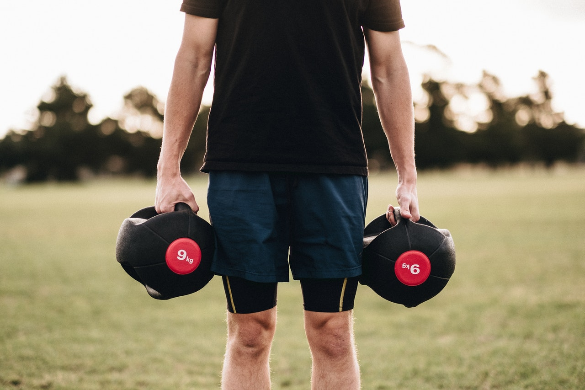

Spaceship by [COMPTRAIN](https://comptrain.co/home-gym/), short Core by myself.

**METCON: Spaceship 
5 Rounds for Time** 
* 100m Single DB [Farmers Carry](https://www.youtube.com/watch?v=p5MNNosenJc)
* 200m Run
* 30 [Dumbbell/Odd-Object Swings](https://www.youtube.com/watch?v=uB-fq0HqGK0)

*Notes* 
You can use any weight you want for the Farmers Carry, or substitute with 50 Step Ups. 
If you have a Rower or Bike, you can substitute the run with 200m on the given machine.

**CORE** 
30 - 20 - 10 
* [Starfish V Ups](https://www.youtube.com/watch?v=ZDxqMzMLkRc)
* seconds [Tuck Hold](https://www.youtube.com/watch?v=vsVYBaWwac8)
* [Arch Ups](https://www.youtube.com/watch?v=RbOtOLnaeUQ)
* seconds [Arch Hold](https://www.youtube.com/watch?v=prz7jmsyOaQ)

*Notes* 
Workout goes 30 Sit Ups, 30sec Tuck Hold, 30 Arch Ups and 30sec Arch Hold, then 20 Sit Ups, etc.

