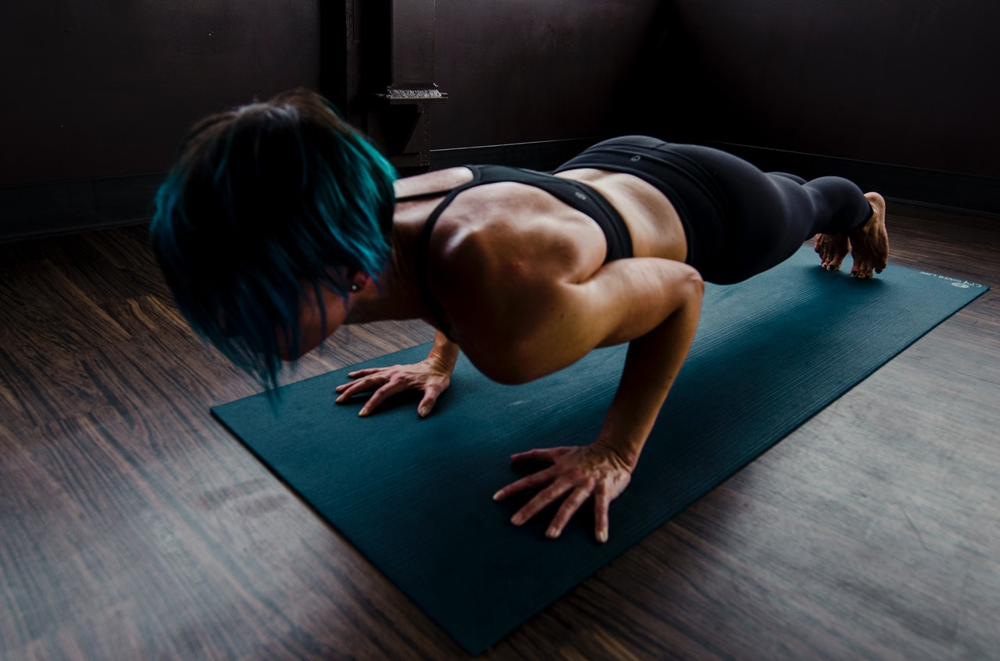

Today we have some quality work and kind of a redo...

**Quality Work: 4 Rounds 40sec on 20sec off 
* [Good Mornings](https://www.youtube.com/watch?v=YA-h3n9L4YU) (banded or with barbell)
* [Hollow Hold](https://www.youtube.com/watch?v=XzQe1S91Fr0)
* [Hamstring Sliders](https://www.youtube.com/watch?v=pBnySBa9srE)

*Notes* 
Do all 3 exercises 4 times. Workout goes 40sec Good Mornings, 20sec rest, 40sec Hollow Hold 20sec rest, etc. 
Total work time is 12min.

**METCON: Kind of a Redo** 
As fast as possible: 
* 100 [Burpees](https://www.youtube.com/watch?v=auBLPXO8Fww)
* 100 [Air Squats](https://www.youtube.com/watch?v=C_VtOYc6j5c)

