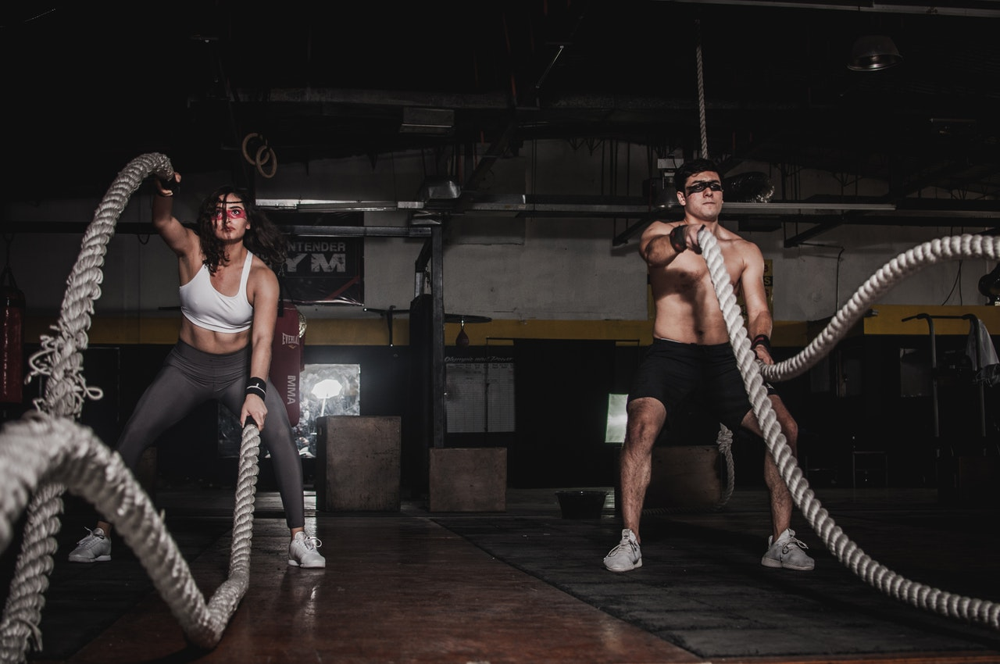

Today's workout is completely taken from [COMPTRAIN](https://comptrain.co/home-gym/).

**METCON: "White Knuckles" for time**
* 20 [Strict Pull-Ups](https://www.youtube.com/watch?v=HRV5YKKaeVw) or [Odd-Object Rows](https://www.youtube.com/watch?v=5bTX5qKWtEA&feature=youtu.be)
* 400m Run or Row or Bike
* 40 [Double Dumbbell Power Cleans](https://www.youtube.com/watch?v=viWI2rEt-HU) or [Odd-Object Ground to Shoulder](https://www.youtube.com/watch?v=XFG7MQU1uS0&feature=youtu.be)
* 800m Run or Row or Bike
* 40 [Double Dumbbell Push Jerks](https://www.youtube.com/watch?v=rnN3pYswScE) or Odd-Object Shoulder to Overhead
* 400m Run or Row or Bike
* 20 Strict Pull-Ups or [Odd-Object Rows](https://www.youtube.com/watch?v=5bTX5qKWtEA&feature=youtu.be)

*Notes* 
If you do not have 2 dumbbells, you can do 40reps each arm.

**CORE - Alternating Tabata for 16 Sets (8 Rounds):** 
* :20s Max Sit-Ups, :10s [Hollow Hold](https://www.youtube.com/watch?v=4xRpGgttca8)
* :20s Max [Glute Bridges](https://www.youtube.com/watch?v=WtilA9IJX1c), :10s Glute Bridge Hold

*Notes:* 
The above amounts to one "round", and also 1:00 on the clock. Eight rounds in full. Not for tracked score.

