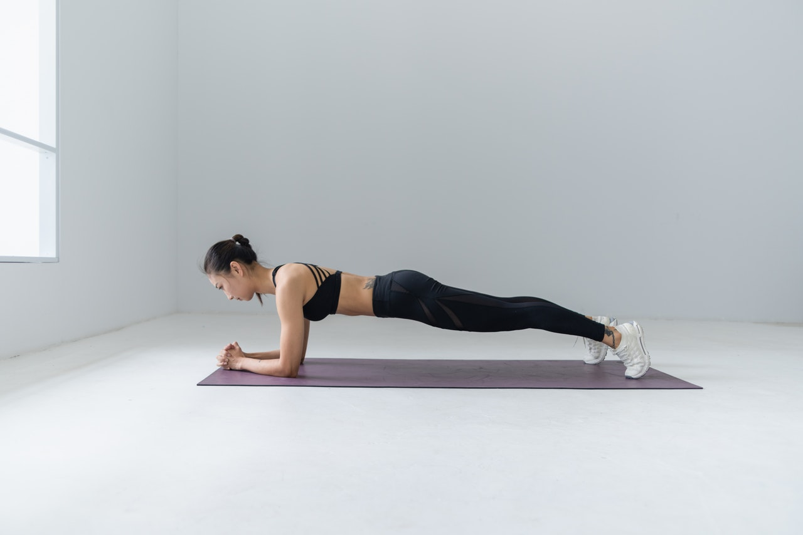

Today's workout is partially taken from [Sonny Websters](https://sonnywebsteracademy.com/) "Home Crossfit Plan" (we skip the 100 Burpees for now).

**METCON**
* 1000 [Double Unders](https://www.youtube.com/watch?v=-tF3hUsPZAI) or 2000 Single Unders - every trip complete 10 Squats

*Notes* 
If you do not have a Rope you can do 1000 [lateral jumps](https://www.youtube.com/watch?v=B6xIT7DMHVo) and do 10 Squats every 200reps

**CORE** 
* Complete 10 mins accumulative plank in as many sets as needed.

