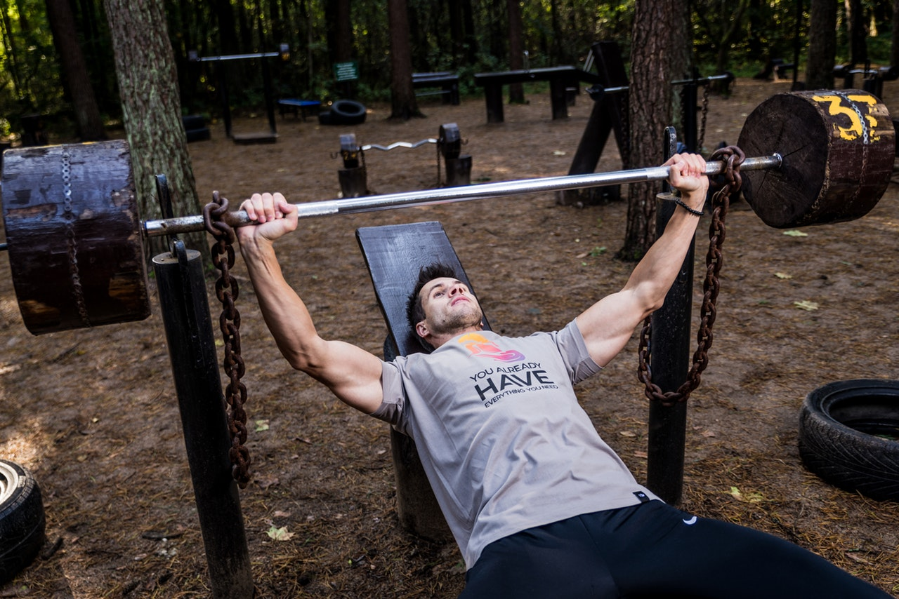

This one is really hard. But fun :) and adapted The Progrm Mash! 
You can find the original one [here](https://www.instagram.com/p/B_FX3AVpAwM/). 
I switched the DB exercises with some Kickboxing exercises.

**Buy In**
* 100 [Double Unders](https://www.youtube.com/watch?v=-tF3hUsPZAI) or 50 [Jumping Jacks](https://www.youtube.com/watch?v=SfaNwjsK0Lo)
* 30 [Single Arm Devils Press](https://www.youtube.com/watch?v=0tonI1Z7CTM) 

*Straight into:* 

**3 Rounds**
* 40 alt. Jab + Punch + Round
* 10 [Pistol Squats](https://www.youtube.com/watch?v=Yfd2BXnEcbg) or [Goblet Squats](https://www.youtube.com/watch?v=mF5tnEBrdkc) 
*5min Rest* 

**Buy in**
* 100 Double Unders or Jumping Jacks
* 20 Single Arm Devils Press 

*Straight into:* 

**3 Rounds**
* 60 Squat + Front-Kick
* 20 alt. [Jumping Lunges](https://www.youtube.com/watch?v=1ExU8445rbU) 
*5min Rest* 

**Buy In**
* 100 Double Unders or 50 Jumping Jacks
* 10 Single Arm Devils Press 

*Straight into:* 

**3 Rounds**
* 120 Air Punches
* 30 Goblet Squats

*Notes* 
Use any weight you want for the Devils Press and Goblet Squats (I used a 22.5kg DB). Use the bag if you have one. 
And: Don't die.

