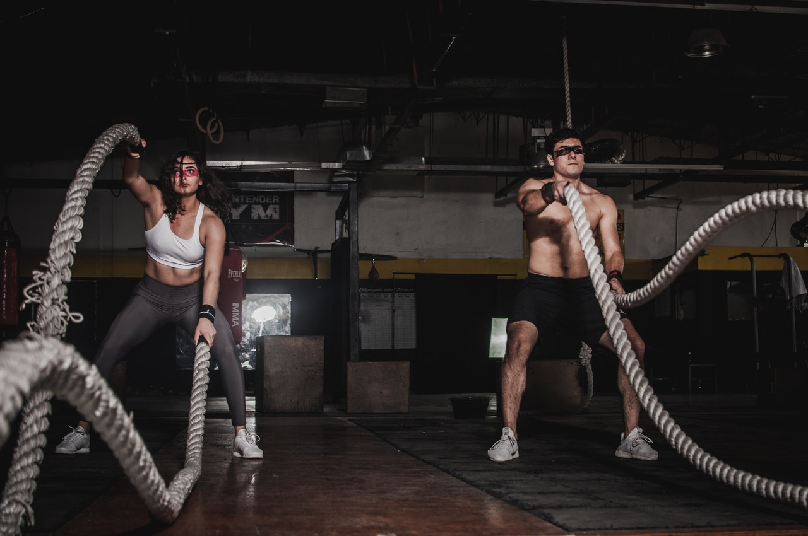

AMRAP from [COMPTRAIN](https://comptrain.co/home-gym/), Core from the one and only [Durante](https://www.instagram.com/davedurante).

**[AMRAP](https://www.yourdictionary.com/amrap) 15min "Farm Land"** 
9 strict Pullups 
15 [Hand Release Push-Ups](https://images.app.goo.gl/ToznrytiroJtHNSM7) 
21 [Kettlebell/Dumbbell Swings](https://images.app.goo.gl/8eZdhM2U8BieW6p88) 
*Notes* 
Pullups can be replaced with [banded pulldowns](https://www.youtube.com/watch?v=erv3HGdNMFI) or any [other replacement](https://wepullup.com/pull-up-alternatives/). 
Kettlebell/Dumbbell can be replaced with any object that has a certain weight (loaded Backpack, Books, Sixpack Water/Beer, your Dog, ...) 
I used a 22.5kg Dumbbell 

**Durante CORE: 5 Rounds** 
10 Hollow Rocks 
10 V-Ups 
10 Tuck Ups 
10 second Hollow Hold 
1 minute Rest 
*Notes* 
If you can't do V-Ups, double the Tuck Ups to 20. 

**Stay healthy (mind and body)!**

