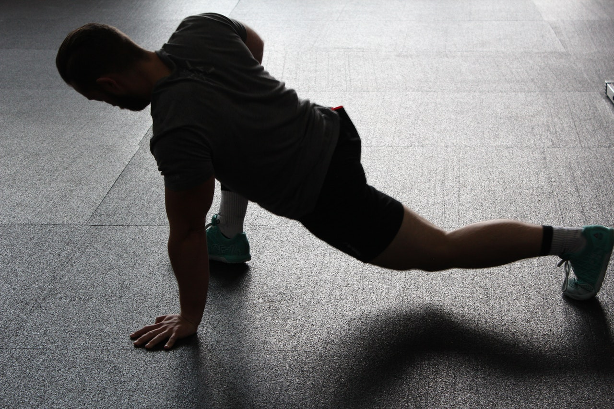

A short 10min Recovery WOD.

**10min AMRAP** 
* 10 Kettlebell/Dumbbell/Object Swings
* 10 Burpees
* 10 Sit-Ups
* 10 Air Squats

**Stretching for 10min**

*Notes* 
This is one of my most used Recovery WODs if I'm not feeling well or have something hard on the next day, but I still want to move. 
4-6 Rounds are optimal, you can even switch it up to a 4-6 Rounds for Time if you want to.

