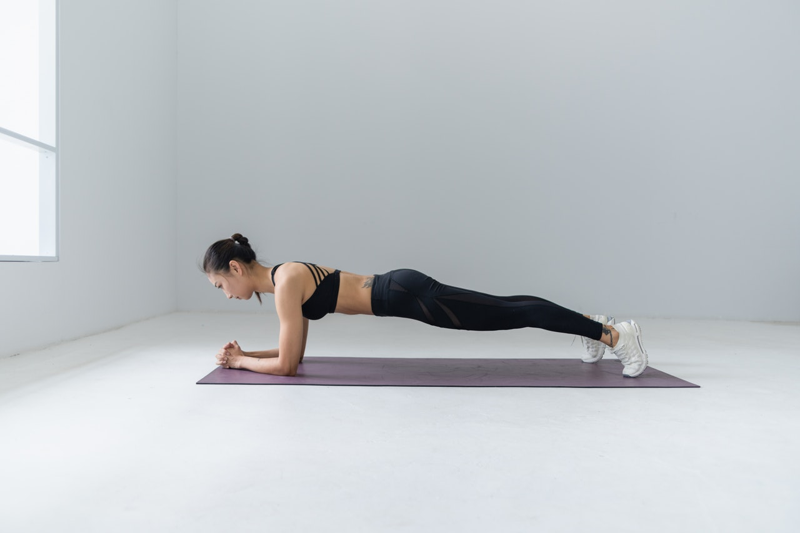

Today has a nice AMRAP from [Noah Olsen](https://www.noahohlsen.com/) and an intensive Core piece from [COMPTRAIN](https://comptrain.co/home-gym/).

**[AMRAP](http://www.thewodgenerator.com/definitions/amrap) 15min** 
15 [Jumping Squats](https://images.app.goo.gl/5ZQ15nLN86NHdY4K6) 
10 [Pushups](https://images.app.goo.gl/AEjh3cbnDkDvDwZGA) 
5 [Burpees to target](https://www.youtube.com/watch?v=FToMxgFU3v8) or [Devils Press](https://www.youtube.com/watch?v=bBNvWdeNrq8) if you got Dumbbells 

**CORE** 
Tabata: 
* [Single Arm Plank](https://images.app.goo.gl/11RbaSe7gpUMvNgP9) alternate every round
* [Glute Bridges](https://images.app.goo.gl/EZ8h6efYCNGtTwga7)
* Single Arm Plank alternate every round
* [Flutter Kicks](https://images.app.goo.gl/wugdCFCcer4tYJLu6)

*Notes*

* We'll work through all 8 tabata rounds of a movement before going to the next movement
* A tabata is :20 seconds work :10 seconds of rest
* You'll spend 4 minutes at each station (= 8 rounds)
* Total workout time is 16mins

**Keep going. And enjoy the time you have for yourself now.**

