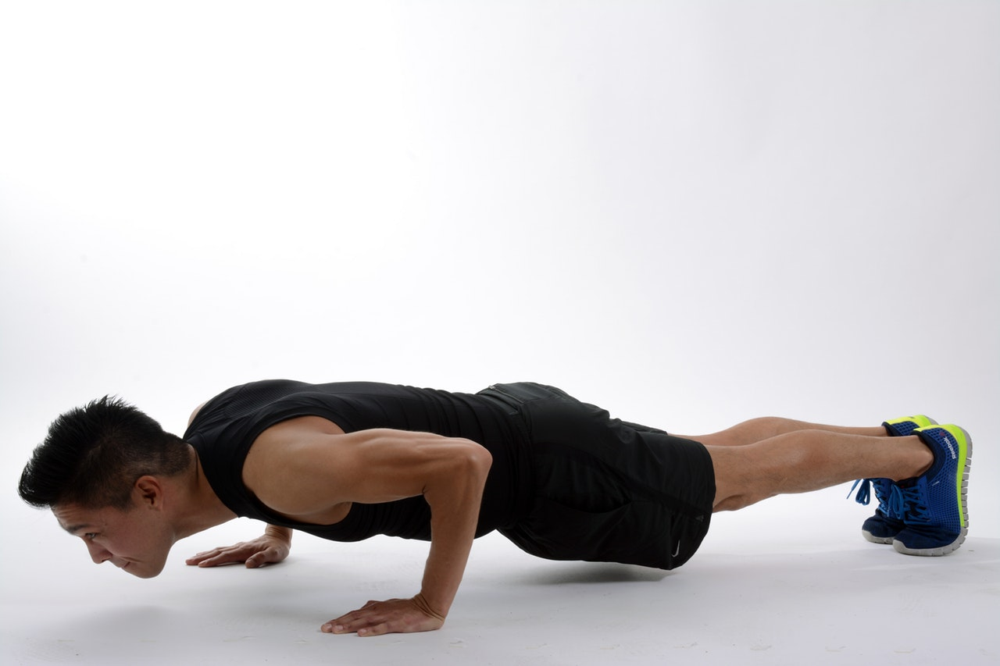

Some quality work from [TheProgrm](https://theprogrm.com/) and a short but intense capacity test.

**10 Rounds for Quality** 
1-3 [Wall Walks](https://www.youtube.com/watch?v=2TnX8j29tRY) 
10 [Tuck Ups](https://www.youtube.com/watch?v=obVuc0wZoss) 
10 [Cossack Squats](https://www.youtube.com/watch?v=YvxmS5BIPi8) 

**For Time** 
100 [Burpees](https://www.youtube.com/watch?v=auBLPXO8Fww)

*Notes* 
I know here are a lot of Burpees these days, but they are just great for our bodies :) 
so try to go as fast as possible. Always touch the ground with your chest, push ups are not required (or useful).
I got 6:38 - some motivation for you ;) 

**Log your time for the burpees. We'll de do this again.**

